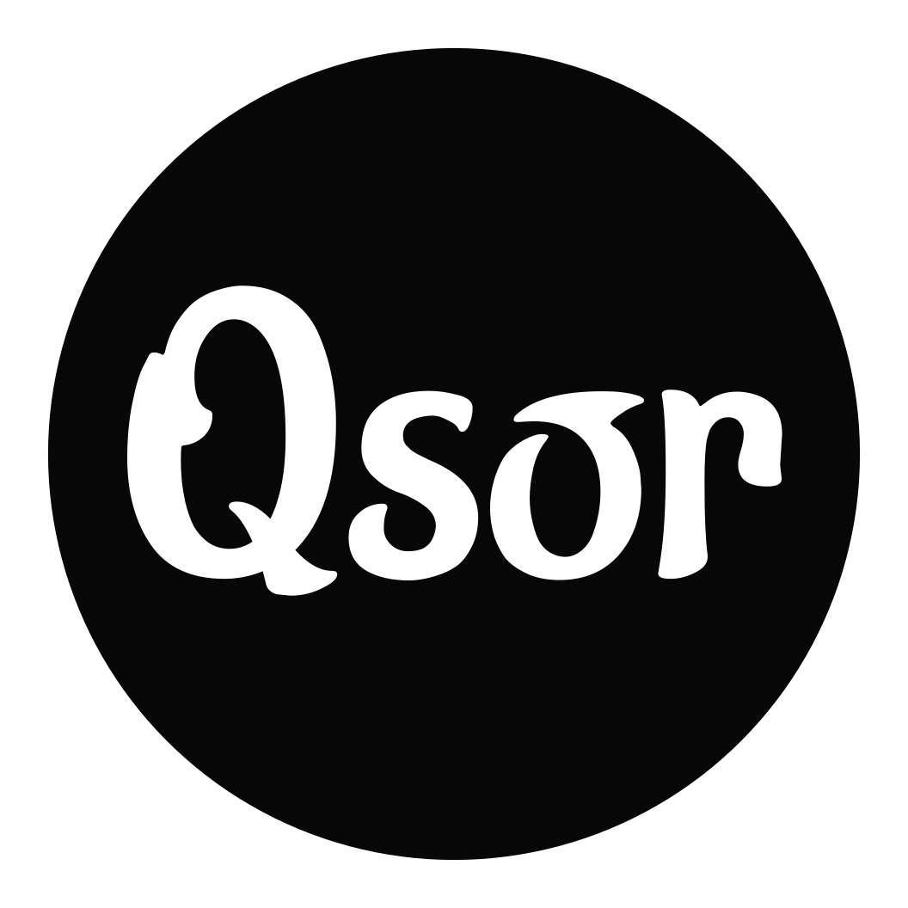

<p align="center">
  
</p>

## Qsor

[](https://discordapp.com/invite/5cBtMPW)

Next generation Akatsuki client.

## Requirements

#### Knowledge

you'll need Prior knowledge in C\# and .NET Core 3 and osu!Framework if you want to Develope on Qsor!

#### Dependencies

* [Dotnet Core 3.1](https://dotnet.microsoft.com)

## Setup Qsor
If you're a not a developer, you can simply go over to the [releases here](https://github.com/osuAkatsuki/Qsor/releases) and get the latest release.

but if you're one, there you go: 
```text
:~$ git clone https://github.com/osuAkatsuki/qsor.git
:~$ cd qsor
:~$ dotnet run Qsor.Desktop -c Release
```

## License

Qsor's code is licensed under the [MIT licence](https://opensource.org/licenses/MIT). Please see [the licence file](./LICENSE) for more information. [tl;dr](https://tldrlegal.com/license/mit-license) you can do whatever you want as long as you include the original copyright and license notice in any copy of the software/source.
